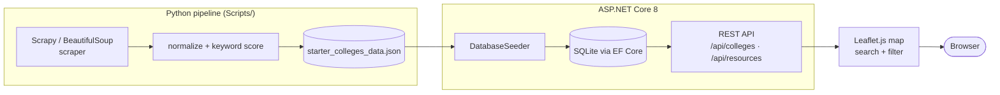

# College Mental Health Resources Database

An interactive map of mental health resources at colleges across the U.S. Midwest
and beyond, built to help students (especially freshmen) find counseling, crisis
lines, and support services at their school.

[](https://github.com/ray-aqno/Mental-Health-Database/actions/workflows/ci.yml)
[](https://mental-health-database.onrender.com)
[](https://dotnet.microsoft.com/)
[](LICENSE)

**[🔗 Live app](https://mental-health-database.onrender.com)** — 38 colleges,
83 resources, across 10 states. Presented to my graduating class of ~900 seniors.

> Note: the live app runs on Render's free tier and cold-starts after inactivity,
> so the first load can take up to a minute.

## What it does

- **Interactive map** — colleges plotted with Leaflet.js; click a pin for that
  school's counseling center, crisis lines, and support services.
- **Real-time search + filtering** — find a school or filter by state.
- **Freshman-focused guidance** — resources flagged with notes aimed at students
  new to campus.
- **Crisis resources** — national hotlines surfaced on every view (see below).

## Architecture

Data is scraped and normalized by a Python pipeline, seeded into SQLite through
EF Core on app startup, served over a REST API, and rendered on a Leaflet map.



`starter_colleges_data.json` is the source of truth for the live map: the seeder
loads it into an empty database on each deploy.

## Tech stack

| Layer | Choice |
|-------|--------|
| Backend | ASP.NET Core 8, C# |
| Data | Entity Framework Core + SQLite |
| API | REST, JSON |
| Frontend | Vanilla JS + Leaflet.js, custom CSS (no framework) |
| Scraping | Python, Scrapy, BeautifulSoup |
| CI | GitHub Actions (Python + .NET tests) |
| Hosting | Render |

## Running locally

Requires the .NET 8 SDK.

```bash
dotnet restore MentalHealthDatabase.sln
dotnet run
# Visit http://localhost:5000
```

On first boot the app seeds a local SQLite database from
`Scripts/starter_colleges_data.json`. See [CONTRIBUTING.md](CONTRIBUTING.md) for
the scraper pipeline and test instructions.

## Crisis resources

If you or someone you know is struggling, help is available 24/7:

- **988 Suicide & Crisis Lifeline** — call or text **988**
- **Crisis Text Line** — text **HELLO** to **741741**
- **SAMHSA National Helpline** — **1-800-662-4357**
- **The Trevor Project** (LGBTQ+ youth) — **1-866-488-7386**

## License

[MIT](LICENSE) © 2026 Rayyan Aquino
